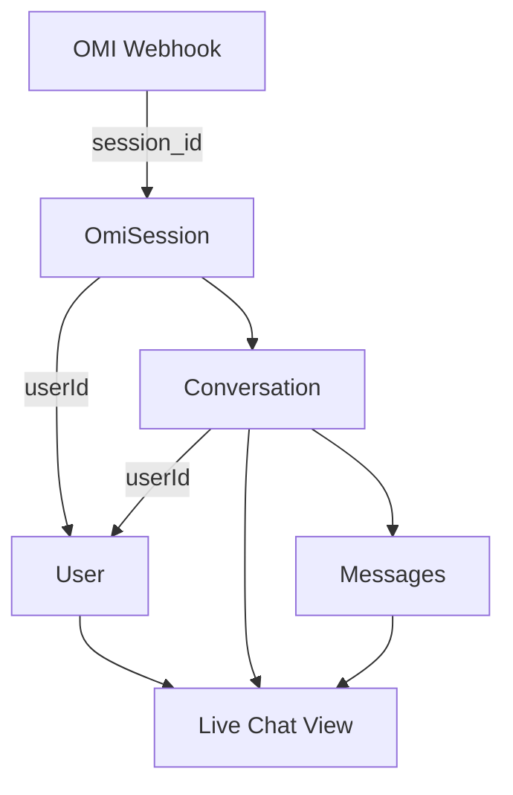

# Session Linking Guide for Live Chat

## Overview
For live chat to work in the Expo app, the OMI `session_id` must be linked to the user's account in the database.

## How It Works

### Automatic Linking (Recommended)
When the OMI device knows the user, it includes the `uid` (device ID) in webhook calls:

```json
POST /omi-webhook
{
  "session_id": "session-123",
  "uid": "device-123",  // Links session to user automatically
  "segments": [...]
}
```

### Manual Session Linking
If the device can't send `uid`, you can manually link a session:

```javascript
// In Expo app
await apiLinkSession("session-123");
```

Or via API:
```bash
curl -X POST http://your-api/sessions/link \
  -H "Cookie: sid=USER_SESSION_TOKEN" \
  -H "Content-Type: application/json" \
  -d '{"session_id": "session-123"}'
```

## Implementation Details

### 1. Session Creation
Every webhook call creates/updates an `OmiSession` record:
- Stores `session_id` as `omiSessionId`
- Links to `userId` if known
- Updates `lastSeenAt` timestamp

### 2. Conversation Linking
Conversations are linked through:
- Direct `userId` field
- Through `omiSessionId` → `OmiSession.userId`

### 3. Live Updates
The chat tab retrieves conversations by:
```sql
-- Direct user conversations
SELECT * FROM Conversation WHERE userId = ?

-- OR conversations from user's sessions
SELECT * FROM Conversation 
WHERE omiSessionId IN (
  SELECT id FROM OmiSession WHERE userId = ?
)
```

## Setup Steps

### Step 1: Get User's Session ID
The session ID is typically:
- Generated by the OMI device
- Unique per conversation/session
- Sent with every webhook call

### Step 2: Link Session to User

#### Option A: Device Sends UID
Configure OMI device to include user's device ID:
```json
{
  "session_id": "abc-123",
  "uid": "user-device-456",
  "segments": [...]
}
```

#### Option B: Manual Linking
After user logs in, link their active session:
```javascript
// Get session ID from OMI device somehow
const sessionId = getOmiSessionId();

// Link it to logged-in user
await apiLinkSession(sessionId);
```

#### Option C: Pre-configured Sessions
Store session IDs when issuing devices:
```javascript
// When giving device to user
const deviceSession = generateSessionId();
await linkSessionToUser(deviceSession, userId);
// Configure device with this session ID
```

### Step 3: Verify Linking
Check if session is linked:
```bash
# Check current conversation
curl http://your-api/conversations/current \
  -H "Cookie: sid=USER_SESSION"

# Should return conversation if linked
```

## Database Flow



## Troubleshooting

### Chat Not Updating
1. Check session is linked:
   ```sql
   SELECT * FROM OmiSession 
   WHERE omiSessionId = 'your-session-id';
   -- Should have userId field populated
   ```

2. Check conversations exist:
   ```sql
   SELECT * FROM Conversation 
   WHERE omiSessionId = (
     SELECT id FROM OmiSession 
     WHERE omiSessionId = 'your-session-id'
   );
   ```

3. Verify user linkage:
   ```sql
   SELECT * FROM OmiSession 
   WHERE userId = 'your-user-id';
   ```

### Session Not Linking
- Ensure `uid` matches a verified `OmiUserLink.omiUserId`
- Or manually link using `/sessions/link` endpoint
- Check database write permissions

### Messages Not Saving
- Verify background queue is running
- Check for errors in `CONVERSATION_SAVE` jobs
- Ensure database connection is stable

## API Endpoints

### Link Session
```
POST /sessions/link
Body: { "session_id": "session-123" }
Response: { "ok": true, "session": {...} }
```

### Get Current Conversation
```
GET /conversations/current
Response: { 
  "ok": true, 
  "conversation": {...}, 
  "messages": [...] 
}
```

### Stream Live Updates
```
GET /conversations/current/stream?sid=TOKEN
Response: Server-Sent Events stream
```

## Best Practices

1. **Link Early**: Link session as soon as user logs in
2. **Persist Session**: Use same session ID for user's device
3. **Handle Disconnects**: Re-link if session expires
4. **Monitor Health**: Check linking status regularly

## Example Implementation

```javascript
// On app login
async function onUserLogin(user) {
  // Get or generate session for user's device
  const sessionId = await getDeviceSessionId();
  
  // Link session to user
  const linked = await apiLinkSession(sessionId);
  
  if (linked) {
    // Start live chat updates
    startChatStream();
  }
}

// When receiving OMI webhooks
async function handleOmiWebhook(data) {
  // Include uid if known
  const webhook = {
    session_id: data.session_id,
    uid: getUserDeviceId(), // Optional but recommended
    segments: data.segments
  };
  
  await sendWebhook(webhook);
}
```

## Summary

For live chat to work:
1. **Session must exist** - Created automatically on webhook
2. **Session must be linked** - Via `uid` or manual linking
3. **Conversations must be saved** - Happens in background queue
4. **User must be authenticated** - To retrieve their conversations

The system handles the rest automatically!